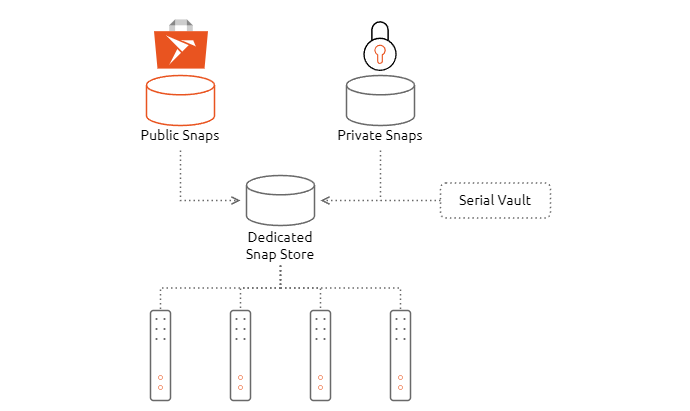

..  This page is intended to serve as the main navigation page for Explanation documents. See https://diataxis.fr/explanation/ for more
    information, or contact secondskoll (or the TA team) on Mattermost. 

Explanation
===========

A Dedicated Snap Store is a custom application store tailored to software distribution across fleets of devices. This store allows you to create, publish and distribute software on one centralized platform, with reliable over-the-air updates to your devices in a secure and validated way. Dedicated Snap Stores are adopted by a large number of enterprises around the world, with a variety of IoT use cases. It is the private, enterprise equivalent of the global Snap Store.

   
   Illustration of Dedicated Snap Store architecture demonstrating use of a combination of public and private snaps

A Dedicated Snap Store is suited for managing software on huge numbers of distributed devices. You can cherry pick the combination of applications you want your devices to use, including software published in the global Snap Store and custom software from your private Dedicated Snap Store. Using software curation, you have an endless number of applications to craft, test and use.

.. rubric:: Helpful resources

* `Dedicated Snap Stores <https://ubuntu.com/internet-of-things/appstore>`_
* `Dedicated Snap Store Datasheet <https://assets.ubuntu.com/v1/d6d1d3fc-IoT+App+Store+Datasheet+v3.pdf>`_

.. toctree::
   :maxdepth: 2
   :glob:
   :hidden:

   explanation/*

