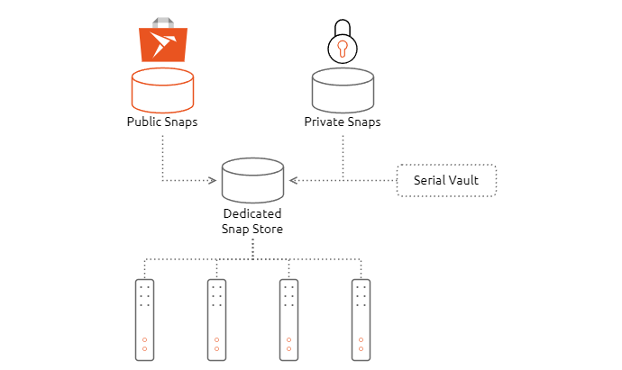

(snap-inclusion)=
# Include snaps

Snap inclusion and exclusion are terms used with the Dedicated Snap Store to describe which applications can be seen by the connected devices. 

*Illustration of the App Store architecture, demonstrating use of a combination of public and private snaps*

For a set of devices to see snaps, the administrator must ‘include’ them in the dashboard of the Dedicated Snap Store. They can decide whether to include public snaps from the global Snap Store or private snaps from the Dedicated Snap Store. Once included for a specific set, or model, of devices, the snaps will be visible to those devices. If for any reason a snap is no longer needed on those devices, the snap can be removed from the device view store in the dashboard of the Dedicated Snap Store. In the case of exclusion, the snap will still exist in either the public Snap Store or Dedicated Snap Store. However, it will no longer be visible to devices.
