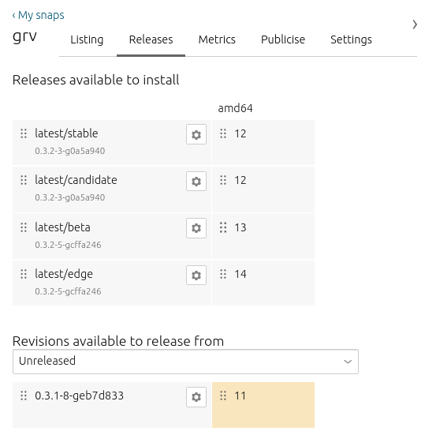

(updating-software)=
# Update software

By default, devices connected to an App Store can check for updates every six hours. Should a software update be available within this interval, connected devices update automatically, meaning software is always secure. This update frequency can be modified to schedule updates at a time convenient to the user of the device (for instance, updating during scheduled downtime periods for devices in a factory).

## Transactional, OTA, delta updates

A Dedicated Snap Store harnesses the power of transactional, over-the-air updates. This means that if for any reason an update pushed to a device fails, the software will roll back to its last stable state. Transactional updates make updating software worry-free, without risk of failure, which is a huge advantage when managing devices in the field. Over-the-air (OTA) updates serve devices distributed across the world.

Our technology implements delta updates, when they are available. This means that whenever there is a new release, only the code that has changed will be downloaded, not the entire application code. By using delta updates, the amount of data downloaded on each release and the quantity of storage space required on the device is minimized. This in turn reduces the time taken for an update to be implemented.

## Release management

Software updates are not necessarily applied to devices when they are fetched automatically. You can determine what specific software revisions get applied to your fleet. Decoupling software updates from installation allows time for testing and validating new revisions before they are applied. The [Snap Store Proxy](https://documentation.ubuntu.com/snap-store-proxy/) provides a way to override revisions of specific snaps for all connected devices, and allows you to execute updates in an environment with limited or no network access.

*The ‘Releases’ dashboard from snapcraft.io*

Channels define which release of a snap is installed and tracked for updates. A channel consists of, and is subdivided into, tracks, risk-levels and branches:

* [Tracks](https://snapcraft.io/docs/channels#heading--tracks) enable snap developers to publish multiple supported releases of their application.
* [Risk-levels](https://snapcraft.io/docs/channels#heading--risk-levels) reflect the stability of a snap.
* [Branches](https://snapcraft.io/docs/channels#heading--branches) help with bug-fixing.

After a snap has been [created](https://snapcraft.io/docs/creating-a-snap) and [released](https://snapcraft.io/docs/releasing-your-app) to the [Snap Store](https://snapcraft.io/store), its published revisions can be moved between [channels](https://snapcraft.io/docs/channels) from both the command line and from the [Snap Store web UI](https://snapcraft.io/docs/using-the-snap-store).
