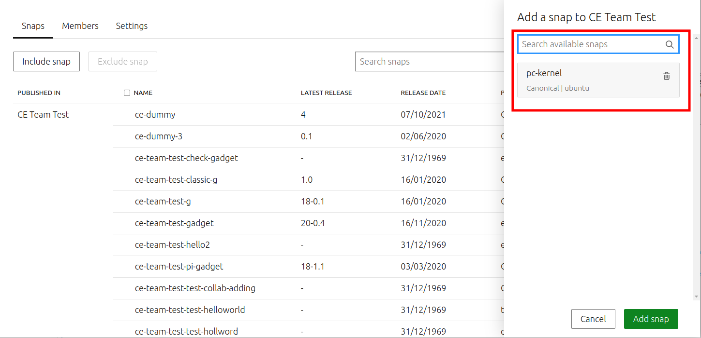
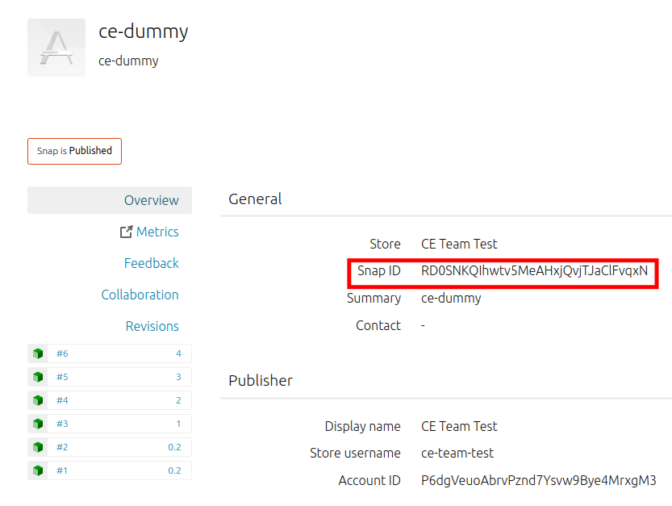

Create an Ubuntu Core image
===========================

.. only:: html

    .. note:: :doc:`/reference/configuration-values` contains information relating to the specific configuration of your Dedicated Snap Store.


.. warning:: 

  Example values are provided for store configuration in this document. If you are a Dedicated Snap Store customer, you will be provided with a set of documentation with the details of your store.



To validate that the store was provisioned correctly, and that you are able to access it, we recommend creating and booting an Ubuntu Core image on amd64.

.. note::

    You may need to initialise LXD with `lxd init --auto` before proceeding with some of the following steps.

Creating the gadget snap
------------------------

The first step in building an Ubuntu Core image that can communicate with your store is to build a gadget snap. Gadget snaps do many things, but for our purposes here, the important functionality is generating a serial number and using that serial number, along with a pre-shared API key, to get credentials to talk to the store. You can also use the gadget snap to set default configuration values for application snaps.

To build a custom gadget snap, we start by selecting a suitable candidate from the `Canonical supported gadgets <https://snapcraft.io/docs/the-gadget-snap>`_
and see follow the `instructions on gadget building <https://ubuntu.com/core/docs/gadget-building>`_.

For this particular case, validating the initial store setup, let's use the ``pc-amd64-gadget``. This gadget enables the device to request store credentials from the Serial Vault, as configured above.

.. term::
    :input: sudo snap install snapcraft --classic

.. note::

    As the gadget snap provides a means to provision static snap configuration for the seeded snaps in an image, multiple gadget snaps may be required for different models. Please see the `gadget specification <https://ubuntu.com/core/docs/gadget-snaps>`_ for more details on how to provide default snap and/or system configuration for your models. It's also possible to use a single gadget for multiple devices if there are no configuration differences. If you do this, please be aware that you'll need to ensure that the models in the Serial Vault are associated with the same **API KEY**.

.. term::
    :scroll:
    :input: sudo apt update

    :input: sudo apt install -y git
    :input: git clone -b {{CUSTOMER_UBUNTU_CORE_VERSION}} https://github.com/snapcore/pc-gadget {{CUSTOMER_STORE_PREFIX}}
    :input: cd {{CUSTOMER_STORE_PREFIX}}

.. ISSUE IN DOCUMENT:  https://docs.google.com/document/d/11z7iKogO7FDouJBfYgh9hROK41xDeaPy0ruS2_flyL0/edit?disco=AAAAxWHTvf4

Update the ``name`` field in the `snapcraft.yaml` to ``{{CUSTOMER_STORE_PREFIX}}-pc``. Update the value of the ``MODEL_APIKEY`` environment variable in the ``snapcraft.yaml`` to the value generated during the Serial Vault setup above.  Feel free to also adjust the ``version``, ``summary`` and ``description`` to be more meaningful in your context.

Build the snap:

.. term::
    :input: sudo snapcraft

    ...
    Snapped {{CUSTOMER_STORE_PREFIX}}-pc_{{CUSTOMER_UBUNTU_CORE_VERSION}}_amd64.snap

.. only:: html

    .. note::

        The sample “product_serial” is loosely generated (``date -Is``) in this gadget (in ``snap/hooks/prepare-device``). In production the serial number should be derived from a value inserted during the factory process, or from a unique hardware identifier, for uniqueness and traceability. See `the dmidecode guidance <https://documentation.ubuntu.com/dedicated-snap-store/how-to/dmidecode-to-read-system-sn/>`_ for an example of how to modify the gadget to use dmidecode (x86 only) to read the serial number from the DMI table.

.. only:: latex

    .. include:: ../how-to/dmidecode-to-read-system-sn.rst

Now register the snap name in your Base Snap Store and push the initial revision:

.. term::
    :input: snapcraft whoami

    email:        {{CUSTOMER_BRAND_EMAIL}}
    developer-id: {{CUSTOMER_BRAND_ACCOUNT_ID}}

    :input: snapcraft register {{CUSTOMER_STORE_PREFIX}}-pc --store={{CUSTOMER_STORE_ID}}
    ...
    you, and be the software you intend to publish there? [y/N]: y
    Registering {{CUSTOMER_STORE_PREFIX}}-pc.
    Congrats! You are now the publisher of '{{CUSTOMER_STORE_PREFIX}}-pc'.

    :input: snapcraft push {{CUSTOMER_STORE_PREFIX}}-pc_{{CUSTOMER_UBUNTU_CORE_VERSION}}_amd64.snap
    The Store automatic review failed.
    A human will soon review your snap, but if you can't wait please write in the snapcraft forum asking for the manual review explicitly.

    If you need to disable confinement, please consider using devmode, but note that devmode revision will only be allowed to be released in edge and beta channels.
    Please check the errors and some hints below:
      - (NEEDS REVIEW) type 'gadget' not allowed

.. note::

    The Brand Account must be a **Publisher** under `Manage Users and their roles <https://dashboard.snapcraft.io/dev/store/{{CUSTOMER_STORE_ID}}/permissions/>`_ to register and publish the gadget snap. However, as previously mentioned, once the gadget snap has been registered, publishing the snap should be left to collaborators. Also please ensure that when registering your gadget snap, you set the visibility of your gadget snap to Public. This only affects visibility of the snap to authorized devices and/or developers, it does not make the snap visible to the outside world. You can check the visibility of your snaps at https://snapcraft.io/snaps. 

Log into the web dashboard as ``{{CUSTOMER_ADMIN_EMAIL}}`` (because it has the **Reviewer** role on the ``{{CUSTOMER_DEVICEVIEW_NAME}}`` store), access the `reviews page <https://dashboard.snapcraft.io/reviewer/{{ CUSTOMER_STORE_ID }}/>`_ and **Approve** the gadget revision.

.. note::

    One other important capability of the Reviewer role is the ability to grant "self-serve" interface connections for snaps published in the Dedicated Snap Store. See `Self-serve Snap Interfaces <https://dashboard.snapcraft.io/docs/brandstores/self-serve-interfaces.html>`_ for more details.

Once the revision is approved, use snapcraft to release it in the stable channel:

.. term::
    :input: snapcraft whoami

    email:        {{CUSTOMER_BRAND_EMAIL}}
    developer-id: {{CUSTOMER_BRAND_ACCOUNT_ID}}

    :input: snapcraft release {{CUSTOMER_STORE_PREFIX}}-pc 1 stable
    Track    Arch    Channel    Version    Revision
    latest   all     stable     {{CUSTOMER_UBUNTU_CORE_VERSION}}     1
                     candidate  ^          ^
                     beta       ^          ^
                     edge       ^          ^
    The 'stable' channel is now open.

The gadget snap is now available for installation from the ``{{CUSTOMER_STORE_NAME}}`` store, and for inclusion in images.

Creating the model assertion
----------------------------

One final step before you can build a custom Ubuntu Core image is creation of a signed model assertion, which provides image related metadata which ubuntu-image uses to customize the image. In order to sign the model assertion, a brand model key must be created and registered using the brand account. For details on how to create and register a model key, please refer to `Sign a model assertion <https://ubuntu.com/core/docs/sign-model-assertion>`_.

Example model assertions can be found `here <https://github.com/snapcore/models>`_. This tutorial provides an example model assertion below.
Once a valid model key is available, create and sign the model assertion for your test Ubuntu Core image:

.. term::
    :input: cat << EOF > {{CUSTOMER_MODEL_NAME}}-model.json

    {
      "type": "model",
      "authority-id": "{{CUSTOMER_BRAND_ACCOUNT_ID}}",
      "brand-id": "{{CUSTOMER_BRAND_ACCOUNT_ID}}",
      "series": "16",
      "model": "{{CUSTOMER_MODEL_NAME}}",
      "store": "{{CUSTOMER_DEVICEVIEW_ID}}",
      "architecture": "amd64",
      "base": "core{{CUSTOMER_UBUNTU_CORE_VERSION}}",
      "grade": "signed",
      "snaps": [
        {
          "default-channel": "latest/stable",
          "id": "<CUSTOMER_SNAP_IDS>",
          "name": "{{CUSTOMER_STORE_PREFIX}}-pc",
          "type": "gadget"
        },
        {
          "default-channel": "{{CUSTOMER_UBUNTU_CORE_VERSION}}/stable",
          "id": "pYVQrBcKmBa0mZ4CCN7ExT6jH8rY1hza",
          "name": "pc-kernel",
          "type": "kernel"
        },
        {
          "default-channel": "latest/stable",
          "id": "amcUKQILKXHHTlmSa7NMdnXSx02dNeeT",
          "name": "core22",
          "type": "base"
        },
        {
          "default-channel": "latest/stable",
          "id": "dwTAh7MZZ01zyriOZErqd1JynQLiOGvM",
          "name": "core24",
          "type": "base"
        },
        {
          "default-channel": "latest/stable",
          "id": "PMrrV4ml8uWuEUDBT8dSGnKUYbevVhc4",
          "name": "snapd",
          "type": "snapd"
        },
        {
          "name": "console-conf",
          "type": "app",
          "default-channel": "24/stable",
          "id": "ASctKBEHzVt3f1pbZLoekCvcigRjtuqw",
          "presence": "optional"
        },
        {
          "default-channel": "latest/stable",
          "id": "<CUSTOMER_SNAP_IDS>",
          "name": "<CUSTOMER_REQUIRED_SNAPS>",
          "type": "app"
        }
      ],
      "timestamp": "$(date +%Y-%m-%dT%TZ)"
    }
    EOF

    :input: snapcraft list-keys
        Name          SHA3-384 fingerprint
    *   serial        <fingerprint>
    *   model         <fingerprint>

    :input: snap sign -k model {{CUSTOMER_MODEL_NAME}}-model.json > {{CUSTOMER_MODEL_NAME}}-model.assert

.. note::

    The timestamp for model assertion MUST be after the date of the model signing key being registered.

Log in to the web dashboard as ``{{CUSTOMER_ADMIN_EMAIL}}`` (because it has the Admin role on the ``{{CUSTOMER_DEVICEVIEW_NAME}}`` store), access the `View and manage snaps <https://snapcraft.io/admin>`_ page. Use the “Include snap” dialog to ensure that all snaps listed in the model assertion but published in the Global Snap Store (like pc-kernel in this case) get included in your Dedicated Snap Store. The core, core18, core20, core22, core24 and snapd snaps are included automatically and cannot be removed.

Access the snap page https://dashboard.snapcraft.io/snaps/<prefix>-pc to get the snap-id and fill the fields ``<CUSTOMER_SNAP_IDS>`` and ``<CUSTOMER_REQUIRED_SNAPS>``.

Switching to a developer account
--------------------------------

Now that the model has been signed by the **Brand Account**, there is no need to continue to use such powerful credentials. We recommend switching to a developer account to seed images.

The account used must have the **Viewer** role on the ``{{CUSTOMER_DEVICEVIEW_NAME}}`` store. Log in to the web dashboard as ``{{CUSTOMER_ADMIN_EMAIL}}`` (because it has the Admin role on the ``{{CUSTOMER_DEVICEVIEW_NAME}}`` store), go to "Manage Users and their roles" to add a developer account and then set it as **Viewer**. You may also give ``{{CUSTOMER_ADMIN_EMAIL}}`` the **Viewer** role.

Set up authentication for downloading snaps from the ``{{CUSTOMER_DEVICEVIEW_NAME}}`` store:

.. term::
    :input: snapcraft whoami

    email:        {{CUSTOMER_VIEWER_EMAIL}}
    developer-id: {{CUSTOMER_VIEWER_ACCOUNT_ID}}

    :input: snapcraft export-login --acls package_access store.auth
    Enter your Ubuntu One e-mail address and password.
    ...
    This exported login is not encrypted. Do not commit it to version control!

.. note::

    Exported credentials have a default expiration of 12 months, so (a) treat them with care, and (b) note that they may need to be refreshed sometime in the future.

Creating the image
------------------

This section describes the details of Ubuntu Core image building against the ``{{CUSTOMER_DEVICEVIEW_NAME}}`` store.

Ensure a Linux LTS environment and tool for building images are both available:

.. term::
    :input: sudo snap install ubuntu-image --classic
    
    ...

In order for ubuntu-image to able to access snaps from your private store, you need to provide your developer credentials using one of the following environment variables:

* ``UBUNTU_STORE_AUTH`` - this must be set to the actual contents of the file (e.g. store.auth) containing your exported developer credentials.
* ``UBUNTU_STORE_AUTH_DATA_FILENAME`` - this must be set to the path of the file containing your exported developer credentials.

The Ubuntu Core image is built in the one line instruction by using the above developer account credential:

.. term::
    :input: UBUNTU_STORE_AUTH=$(cat store.auth) ubuntu-image snap {{CUSTOMER_MODEL_NAME}}-model.assert

    ...

Launching and verifying the image
---------------------------------

To launch and test your newly generated Ubuntu Core image, follow the steps here: `Ubuntu Core: Testing with QEMU <https://ubuntu.com/core/docs/testing-with-qemu>`_. Once the image is booted and installed, you can log in then verify if the seeded snaps are installed, the {{CUSTOMER_MODEL_NAME}}  model is correct and a serial assertion was obtained:

.. note:: The following shows the expected output for a Ubuntu Core 24 image.

.. term::
    :user: {{UBUNTU_SSO_USER_NAME}}
    :host: ubuntu_core_24

    The programs included with the Ubuntu system are free software;
    the exact distribution terms for each program are described in the
    individual files in /usr/share/doc/*/copyright.

    Ubuntu comes with ABSOLUTELY NO WARRANTY, to the extent permitted by
    applicable law.

    Welcome to Ubuntu Core 24

    * Documentation: https://ubuntu.com/core/docs

    This is a pre-built Ubuntu Core image. Pre-built images are ideal for
    exploration as you develop your own custom Ubuntu Core image.

    To learn how to create your custom Ubuntu Core image, see our guide:

    * Getting Started: https://ubuntu.com/core/docs/get-started

    In this image, why not create an IoT web-kiosk. First, connect a 
    screen, then run: 

    snap install ubuntu-frame wpe-webkit-mir-kiosk
    snap set wpe-webkit-mir-kiosk url=https://ubuntu.com/core

    For more ideas, visit:

    * First steps: https://ubuntu.com/core/docs/first-steps

    :input: snap list

    Name                    Version                          Rev    Tracking       Publisher    Notes
    console-conf            24.04.1+git45g5f9fae19+gd81a15d  40     24/stable      canonical✓   -
    core24                  20240528                         423    latest/stable  canonical✓   base
    pc-kernel               6.8.0-40.40                      1938   24/stable      canonical✓   kernel
    snapd                   2.63                             21759  latest/stable  canonical✓   snapd

    :input: snap changes
    ID   Status  Spawn               Ready               Summary
    1    Done    today at 02:48 UTC  today at 02:48 UTC  Initialize system state

    :input: snap model --assertion
    type: model
    authority-id: {{CUSTOMER_BRAND_ACCOUNT_ID}}
    series: 16
    brand-id: {{CUSTOMER_BRAND_ACCOUNT_ID}}
    model: {{CUSTOMER_MODEL_NAME}}
    ... 

    :input: snap model --serial --assertion
    type: serial
    authority-id: {{CUSTOMER_BRAND_ACCOUNT_ID}}
    revision: 1
    brand-id: {{CUSTOMER_BRAND_ACCOUNT_ID}}
    model: {{CUSTOMER_MODEL_NAME}}
    ...
