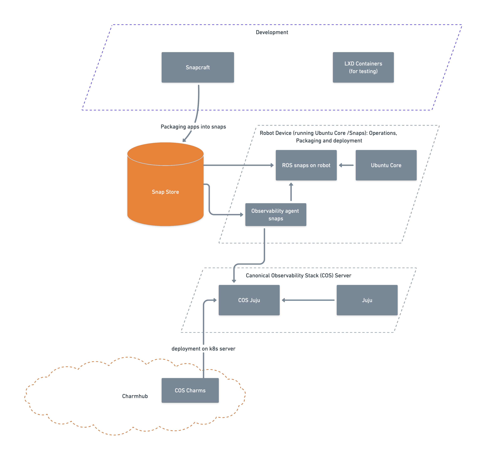

Robotics 
========

The robotics offering from Canonical is a complete suite of technologies that help you develop, package, deploy, maintain and observe your robotics application. An overview of how the different technologies interact with each other is shown below. 

   Robotics: An overview

---------

It is difficult to understand and use the robotics solution without a basic understanding of the related underlying technologies. So this documentation is divided into two main sections. 

---------

.. grid:: 1 1 2 2
   :padding: 0

   .. grid-item:: :doc:`Robotics documentation <local/index>`

      **The robotics offering** - Everything you need to know about the robotics offering, categorized into tutorials, how-to guides, references and explanations.

   .. grid-item:: :doc:`Related technologies <external/index>`

      **Underlying technologies used** - Relevant documentation of each related technology: Snapcraft, Snap store, LXD containers, ROS, Ubuntu Core, COS, Juju and Charmhub   

.. toctree::
   :hidden:
   :maxdepth: 1

   local/index
   external/index

